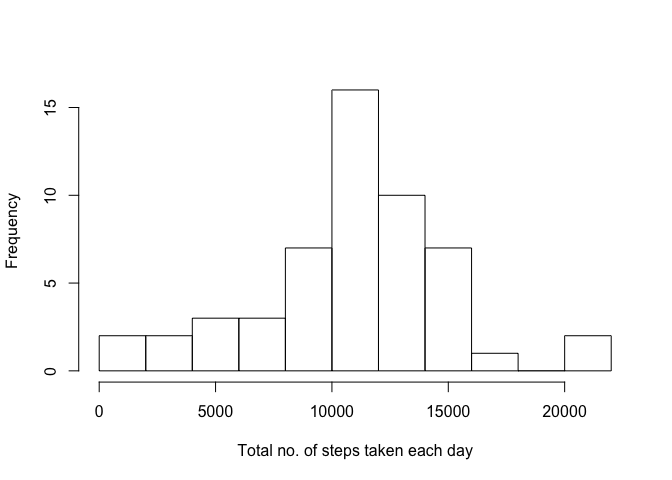
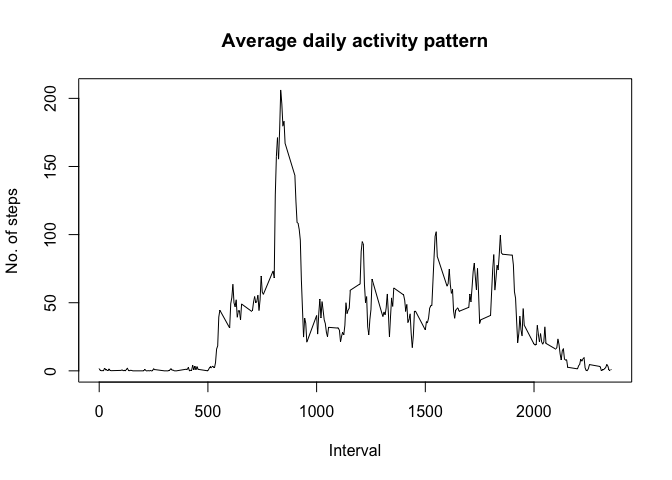
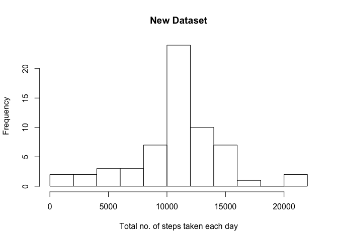
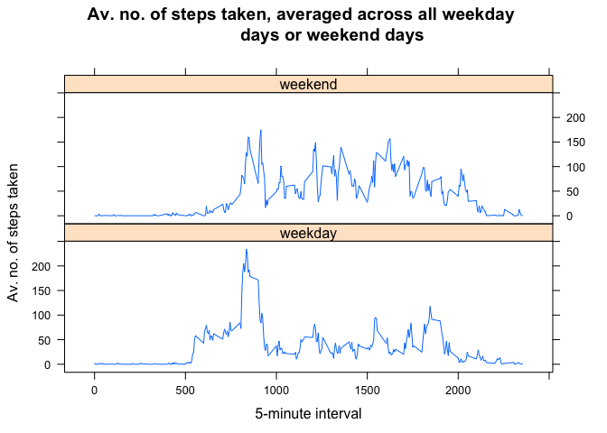

# Reproducible Research: Peer Assessment 1
*By: Lim Zhen Xiong*  

## Introduction

It is now possible to collect a large amount of data about personal movement using activity monitoring devices such as a Fitbit, Nike Fuelband, or Jawbone Up. These type of devices are part of the &quot;quantified self&quot; movement \- a group of enthusiasts who take measurements about themselves regularly to improve their health, to find patterns in their behavior, or because they are tech geeks. But these data remain under-utilized both because the raw data are hard to obtain and there is a lack of statistical methods and software for processing and interpreting the data.  

This assignment makes use of data from a personal activity monitoring device. This device collects data at 5 minute intervals through out the day. The data consists of two months of data from an anonymous individual collected during the months of October and November, 2012 and include the number of steps taken in 5 minute intervals each day.  

## Data

The data for this assignment can be downloaded from the course web site:

- Dataset: [Activity monitoring data](https://d396qusza40orc.cloudfront.net/repdata%2Fdata%2Factivity.zip) [52K]

The variables included in this dataset are:

- **steps**: Number of steps taking in a 5-minute interval (missing values are coded as `NA`)

- **date**: The date on which the measurement was taken in YYYY-MM-DD format

- **interval**: Identifier for the 5-minute interval in which measurement was taken

The dataset is stored in a comma-separated-value (CSV) file and there are a total of 17,568 observations in this dataset.  

## Loading and preprocessing the data  

`dplyr` and `lattice` packages were loaded.  


```r
library(dplyr)
library(lattice)
```

The `activity.zip` file is located in the same working directory as the 
`PA1_template.Rmd` file. Next, we unzip and read the csv file and had a quick 
understanding of the activity data. We also converted the "date" column of the 
dataset into "Date" class.  


```r
data <- read.table(unz("activity.zip","activity.csv"), header=T,quote="\"", sep=",")
str(data)
```

```
## 'data.frame':	17568 obs. of  3 variables:
##  $ steps   : int  NA NA NA NA NA NA NA NA NA NA ...
##  $ date    : Factor w/ 61 levels "2012-10-01","2012-10-02",..: 1 1 1 1 1 1 1 1 1 1 ...
##  $ interval: int  0 5 10 15 20 25 30 35 40 45 ...
```

```r
data$date <- as.Date(data$date)
```
  

## What is mean total number of steps taken per day?  

Missing values in the dataset were ignored using `complete.cases()`. The total
number of steps taken in each day was calculated using `aggregate()` and stored
in `holder`.  


```r
data_complete <- data[complete.cases(data),]
holder <- aggregate(data_complete$steps, list(data_complete$date), sum)
names(holder) <- c("date", "total steps")
```

Histogram of the total number of steps taken each day:  

```r
hist(holder[,2],
     breaks=10,
     main=" ",
     xlab="Total no. of steps taken each day")
```

 

The mean and median were calculated:  

```r
mean_steps <- mean(holder[,2])
mean_steps <- format(mean_steps, scientific=F)
median_steps <- median(holder[,2])
```

The mean and median of the total number of steps taken per day are
**10766.19** and **10765** respectively.  

## What is the average daily activity pattern?

Time series plot of the 5-minute interval (x-axis) and the average number of 
steps taken, averaged across all days (y-axis):  


```r
mean_interval <- aggregate(data$steps, list(data$interval), mean, na.rm=T)
names(mean_interval) <- c("interval", "mean.steps")
plot(mean_interval$interval, 
     mean_interval$mean.steps, 
     type="l", 
     main="Average daily activity pattern", 
     xlab="Interval", 
     ylab="No. of steps")
```

 

5-minute interval, on average across all the days in the dataset, that contains 
the maximum number of steps:


```r
max <- mean_interval[which.max(mean_interval$mean.steps),]
```

Hence the **835th** interval has the maximum mean steps of 
**206.17**.  

## Inputing missing values

Taking the difference in the number of rows in `data_complete` and 
`complete` data.frame:


```r
no.na <- nrow(data) - nrow(data_complete)
```

The total number of rows with `NA`s is **2304**.  

We will replace the `NA` in the data set using the mean number of steps for the 
same interval, averaged across all the days in the dataset.  


```r
new_data <- data
for (i in 1:nrow(new_data)) {
        if (is.na(new_data[i,1])) {
                replace <- mean_interval[which(mean_interval$interval == new_data[i,3]),]
                new_data[i,1] <- replace[,2]                
        }
}
```

Plotting the new dataset with `NA`s replaced:  


```r
new_holder <- aggregate(new_data$steps, list(new_data$date), sum)
names(new_holder) <- c("date", "total steps")
hist(new_holder[,2],
     breaks=10,
     main="New Dataset",
     xlab="Total no. of steps taken each day")
```

 

The mean and median for the new dataset were calculated:  

```r
new_mean_steps <- mean(new_holder[,2])
new_mean_steps <- format(new_mean_steps, scientific=F)
new_median_steps <- median(new_holder[,2])
new_median_steps <- format(new_median_steps, scientific=F)
```

The mean and median of the total number of steps taken per day for the new 
dataset are **10766.19** and **10766.19** respectively.  

Yes these values differ from the estimates from the first part of the 
assignment as shown below:

**- Original dataset:**  
mean = 10766.19  
median = 10765  

**- New dataset:**  
mean = 10766.19  
median = 10766.19  

The impact of inputing missing data on the estimates of the total daily number 
of steps is that the median increased and the mean and median became the same.

## Are there differences in activity patterns between weekdays and weekends?

Created a new factor variable in `data` named &quot;weekdays&quot; with two 
levels \- &quot;weekday&quot; and &quot;weekend&quot;, which indicated whether a 
given date is a weekday or weekend.  

`data` was subset based on the weekdays factor. The mean steps, averaged 
by interval, was calculated for each subset (`mean_wkend` and `mean_wkday`). The
2 subsets were combined. The weekdays factor was introduced into the combined
data frame `mean_join`. The plot was created using `lattice` library.


```r
data$weekdays <- as.factor(ifelse(weekdays(data$date) %in% c("Saturday", "Sunday"), "weekend", "weekday"))
data_wkend <- filter(data, weekdays == "weekend")
data_wkday <- filter(data, weekdays == "weekday")
mean_wkend <- aggregate(data_wkend$steps, list(data_wkend$interval), mean, na.rm=T)
mean_wkday <- aggregate(data_wkday$steps, list(data_wkday$interval), mean, na.rm=T)
names(mean_wkend) <- c("interval", "mean.step")
names(mean_wkday) <- c("interval", "mean.step")
mean_wkend$weekdays <- as.factor("weekend")
mean_wkday$weekdays <- as.factor("weekday")
mean_join <- rbind(mean_wkday, mean_wkend)
p <- xyplot(mean.step ~ interval | weekdays, 
            layout = c(1,2), 
            data=mean_join, 
            type="l",
            main="Av. no. of steps taken, averaged across all weekday 
            days or weekend days",
            xlab="5-minute interval",
            ylab="Av. no. of steps taken")

print(p)
```

 

**Observation:** Yes there were differences in activity patterns between 
weekdays and weekends. The subject was more active on weekends.
